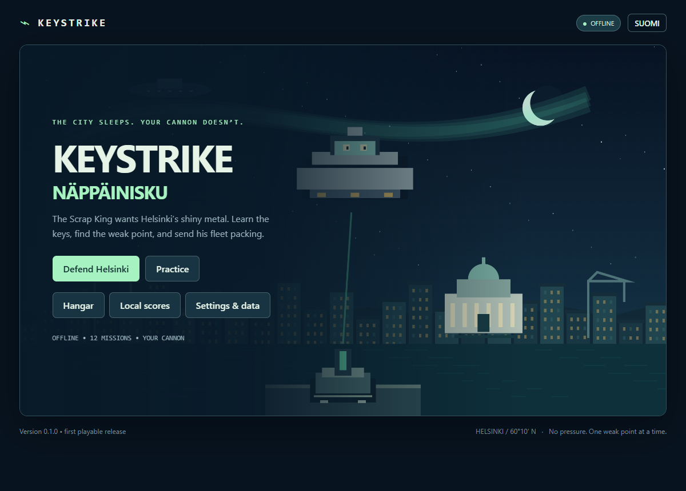
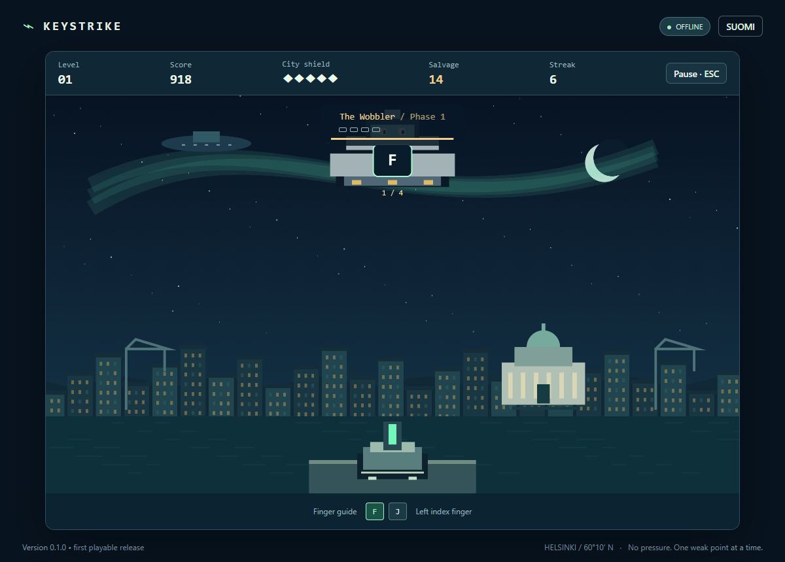
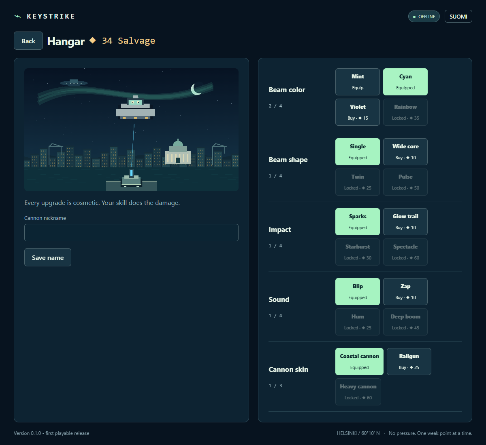

# Keystrike / Näppäinisku

**The city sleeps. Your cannon doesn’t.** An offline retro defense game on Helsinki’s nighttime waterfront. Learn the keys, aim at alien weak points, defeat twelve commanders, and turn their salvage into a cannon of your own.



**v0.1.0 — first playable Windows release.** [Download the executable or portable ZIP](https://github.com/Vkuparin/silly-lab/releases/tag/keystrike-v0.1.0). The ZIP includes quick-start instructions, license notices and the same standalone game executable. Microsoft **WebView2 Runtime is required**, separately from the game.

## Play

Extract into a writable folder and launch `Keystrike.exe`. Finnish is the first-launch default; English is available immediately. Keyboard layout is independent of UI language.

| Track | What you practice |
| --- | --- |
| Keyboard | F/J home position and finger guidance through home row, three rows, FI/SV or US punctuation, digits and named keys. Displayed keys auto-aim. |
| Mouse | Aim inside the ring and press the pictured logical button. Primary-only/trackpad profile available. |
| Mixed | WASD-area key triggers plus aimed clicks, with a separate gaming curriculum. |

All twelve levels have waves, a miniboss and a named commander. Wrong inputs reset streak without damaging the city. Surviving a commander escape still unlocks the next lesson. Every outcome offers **Save score or Skip**. Optional names and top-ten boards stay local; rewards and unlocks do not depend on saving a score.

Standard, generous Relaxed, per-level unlockable Pro, and unranked Practice are available. Late Keyboard/Mixed Pro uses **tap → release → tap** Shift sequences in either order, never held chords or Ctrl combinations. Use any-Shift or Standard when device/accessibility behavior differs. Escape pauses; focus loss and resizing pause automatically. Release keys before launch/resume. Menus support Tab/Enter and primary pointer input.



## Your cannon

Defeats award salvage. Fourteen purchasable tiers customize beam color, shape, impact, sound and skin. Buy sequentially, then equip. Every upgrade is cosmetic: score, timing, targeting and damage rules remain equal. Original synthesized chiptune accompanies original procedural pixel artwork. Calm and reduced motion override spectacle; sound is optional.



## Portable means portable

**No Keystrike-owned artifacts in AppData.** No marker is needed. Saves **and WebView2 cache/profile** always stay in `data/` beside the executable:

```text
Keystrike.exe
data/
  save.json          settings, lessons, cosmetics, scores
  save.backup.json   last-good backup
  session.lock       one instance per folder
  webview/           WebView2 profile/cache
```

Keep `data/` when replacing the EXE for an update. Move the whole folder to transfer progress. Do not run inside a ZIP preview, a protected installation folder or read-only media. Read-only startup reports an error; there is no silent AppData fallback. Later failed writes show pending rewards for retry/discard; purchases cannot spend unsaved rewards.

Settings & data offers JSON backup export/import and separate confirmed resets for scores, lessons, cosmetics and settings. Imports replace data rather than merging currency. Corrupt originals are preserved and backups recover. Interrupted combat does not resume or replay rewards. Browser preview uses separate browser localStorage.

## Develop and update

TypeScript + Canvas + semantic DOM + Web Audio in a Tauri 2 shell. No backend, runtime asset downloads or CI.

```powershell
cd Keystrike
npm ci
npm run dev        # browser preview, port 1430
npm run desktop    # native development
npm run check      # 231 core/content/storage tests + typecheck/build
npm run smoke      # UI playthrough + screenshots (Edge)
npm run release    # Windows EXE, portable ZIP and SHA256SUMS
npm run native:smoke # final packaged WebView2 loop/restart/move
```

Node 24+ (tested on 26), Rust stable/MSVC build tools and WebView2 are needed for development. Dependencies are locked. The release script stages locally; publish namespaced `keystrike-vX.Y.Z` tags after native smoke checks.

**Future agents must read [AGENTS.md](AGENTS.md)** for the preserved planning, architecture, test, storage, versioning and publishing patterns. See [technical decisions](docs/technical-decisions.md), [verification evidence](docs/verification.md), [release notes](docs/releases/v0.1.0.md), [asset provenance](assets/manifest.md), and the original [design](docs/game-design.md), [plan](docs/implementation-plan.md), and [review history](docs/review.md).

This is a playtest release. School-laptop performance, supervised beginner learning/fun and real Sticky/Filter Keys layout compatibility have not been established. Human sessions should guide tuning; synthetic tests do not certify typing progress. Windows x64 only; unsigned executable; WebView2 is not bundled.
