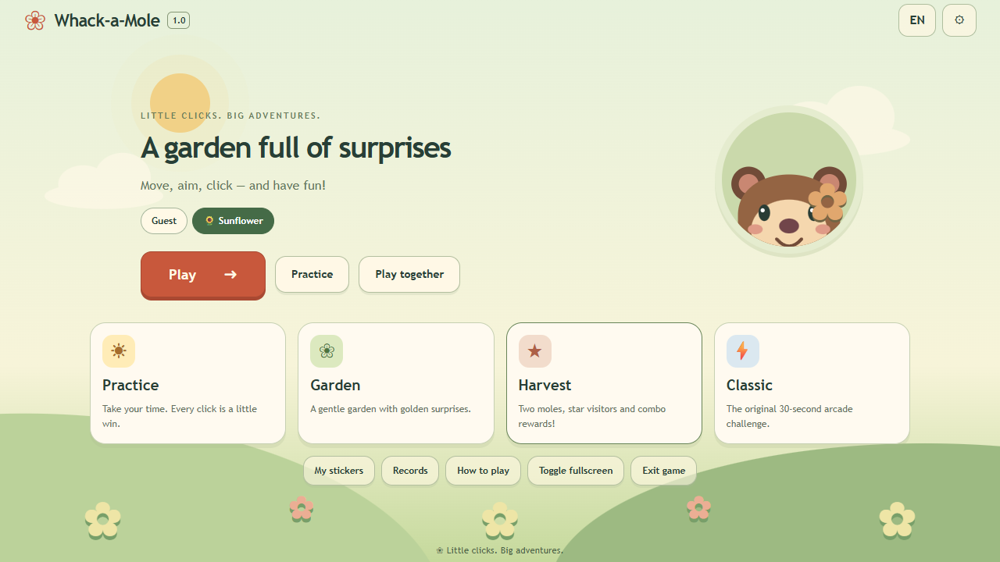

# Whack-a-Mole 1.0.0

A cheerful offline PC game for children aged 3–12 to practice moving, aiming and single-clicking a mouse. Built with Tauri 2, React, TypeScript, Vite and Tailwind; all character art and audio are bundled or synthesized locally.

## Games

- **Practice:** untimed, no bombs, four large holes or nine holes. Moles wait for a click; a golden mole celebrates every fifth hit.
- **Garden:** gentle 30-second rounds, readable bomb warnings, +1 normal/+3 gold, and two guaranteed golden surprises. Bombs cost one point, never below zero.
- **Harvest:** 45 seconds, a second simultaneous target after 15 seconds, +2 star visitors, golden surprises, and a +2 bonus on every fifth consecutive reward hit. Bombs cost two points; escaped rewards break the combo.
- **Classic:** original 30-second scoring, 73/15/12 normal/gold/bomb draw and score-based speed ramp. Moles move on their timer even if not clicked.
- **Play together:** 2–4 players pass one mouse. Same round uses an identical complete Garden schedule at one pace; Own pace offers a clearly labeled handicap game. Ties produce joint winners; rematches rotate player order.

Five pace levels, six local avatar profiles, eight personal stickers, separate records by mode/pace/input, Garden/Snow/Space backgrounds, EN/FI (Finnish default), independent effects/music volume, reduced motion, and picture-led instructions. Every game/background is available immediately.

## Controls and displays

Use the OS primary mouse button, aim at a hole, and click once. Duplicate points are prevented; a brief empty-hole grace period forgives accidental double-clicks. Dragging off the pressed hole cancels the click. No right click or drag is required.

Optional keyboard play uses 1–9 (1–4 in four-hole Practice); held keys do not repeat. Select Keyboard before a round for keyboard records. Mixed gameplay input or changing pace produces an unranked result. Keyboard menu navigation does not change Mouse records.

Pause or Esc pauses play. Losing focus, hiding the window or a long scheduling interruption also pauses; choose Resume to continue. Scored rounds have a skippable ready countdown. Language/audio can change without losing progress.

**The main menu and Settings have Toggle fullscreen and Exit game. Exit closes the native app even in fullscreen.** Alt+F4 also exits. Browser builds leave fullscreen and explain how to close the tab, since websites cannot close ordinary user-opened tabs.

Responsive layouts cover laptop viewports through **5120×1440 ultrawide**, including 16:9, 16:10, 21:9 and 32:9. The board remains centered and bounded for comfortable pointer travel; scenery fills the width. Baseline usable gameplay viewport is 960×640 CSS pixels. A 1280×720 display is supported at 100% scaling; higher Windows scaling needs enough remaining logical space. Native startup size fits the monitor work area. Home and results can scroll; gameplay fits without scrolling on supported viewports.

## Windows downloads and local saves

Release assets:

| File | Use |
| :--- | :--- |
| `whackamole-1.0.0-win-x64.zip` | Extract into a writable folder and run `whackamole.exe` |
| `whackamole_1.0.0_x64-setup.exe` | NSIS installer |
| `whackamole_1.0.0_x64_en-US.msi` | Windows Installer package |
| `SHA256SUMS.txt` | SHA-256 verification for the three packages |

Windows x64 with Microsoft Edge WebView2 Runtime is required. Installers detect it and download its bootstrapper when absent, requiring internet for that step. The portable ZIP does not include the runtime. Once installed, gameplay needs no network, account or telemetry. Packages are unsigned and Windows may show a publisher/SmartScreen prompt.

The portable ZIP includes a `portable.txt` marker; keep it beside the executable. Data lives in its adjacent `data` folder. Copy the entire folder, including data, to carry portable progress. Installed builds without the marker use per-user application data. Moving only the executable does not move saves. Do not run inside the ZIP or from a read-only/protected folder.

Pre-1.0 scores remain untouched under **Legacy scores — mixed settings**. They cannot be placed on new pace-specific boards because the old entries did not record pace. Existing language/audio/pace preferences survive. New records use a validated versioned schema, bounded boards and per-player progress. Corrupt/future-version storage runs session-only without automatically overwriting original data; save failure is visible. Profile deletion and clearing data require explicit confirmation in the game.

## Development and checks

Use a modern Node runtime supporting the existing direct TypeScript test imports (verified with Node 26.10.0), npm, Rust and the standard Windows Tauri toolchain.

| Command | Action |
| :--- | :--- |
| `npm ci` | Install locked dependencies |
| `npm run dev` | Web development server at port 1420 |
| `npm test` | Original compatibility suites plus release logic/input/storage/match tests |
| `npm run build` | Type-check and build frontend |
| `npm run check` | Tests plus frontend build |
| `npm run smoke` | Production browser flows, real pointer events and display screenshots (installed Edge; port 1450) |
| `npm run tauri dev` | Native development |
| `npm run tauri build` | Optimized executable, MSI and NSIS |
| `npm run native:smoke` | Isolated portable native test, including fullscreen Exit, Legacy and relaunch (WebView2; port 9228) |
| `npm run release:package` | Stage built packages and SHA-256 hashes under ignored `release/v1.0.0/` |

Native smoke enables WebView2 debugging only in its child process environment. No remote debugging port, forced-kind API or cheat hook ships in the game. Automated tests use temporary isolated data; avoid sharing test ports with another session.

## Design and verification

- [1.0.0 design](docs/iteration-v1.0.0-design.md)
- [Implementation plan and delivery status](docs/implementation-v1.0.0-plan.md)
- [Release notes](docs/releases/v1.0.0.md)
- [Verification record and limitations](docs/verification-v1.0.0.md)
- [Art manifest](docs/assets.md)

Automation verifies layouts and gameplay; it does not establish age-specific usability. Native fullscreen was tested at 5120×1440 with device scale 1, including Exit. Supervised child playtesting, an independent Finnish copy review, additional physical DPI/monitor configurations, and full installer install/uninstall coverage remain follow-up checks. Fast spatial gameplay is not claimed to provide full screen-reader access. Mouse practice supports familiarization, not formal developmental assessment.
